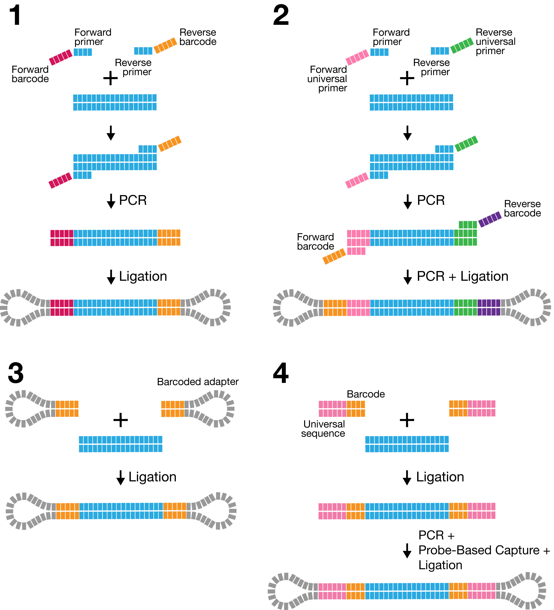
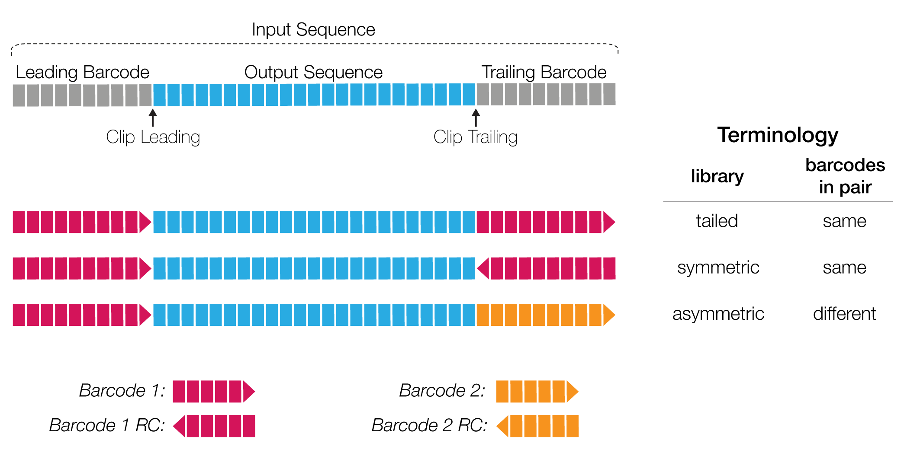

# How to barcode your sample

*Lima* can demultiplex samples that have an unique per-sample barcode pair and
have been pooled and sequenced on the same SMRT cell. There are four different
methods to associate barcodes with a sample, by PCR or ligation:

1. Sequence-specific primers
2. Barcoded universal primers
3. Barcoded adapters
4. Probe-based linear barcoded adapters

# How to combine barcode sequences

In addition, there are three different barcode library designs.
In order to describe a barcode library design, one can view it
from a SMRTbell or read perspective.
As *lima* supports CLR subread and CCS read demultiplexing,
the following terminology is based on the per (sub-)read view.

In the overview above, the input sequence is flanked by adapters on both sides.
The bases adjacent to an adapter are referred to as barcode regions.
A read can have up to two barcode regions, leading and trailing.
Either or both adapters can be missing and consequently the leading and/or
trailing region is not being called.

For the symmetric and tailed library design, the *same* barcode is attached to
both sides of the insert sequence of interest; the only difference is the
orientation of the trailing barcode. For identification, one read with a single
barcode region is sufficient.

For the asymmetric design, a *different* barcode pair is attached to the sides
of the insert sequence of interest. In order to be able to identify a
*different* barcode pair, a read with leading and trailing barcode regions
is required.

Output barcode pairs are generated from the identified barcodes.
The barcode names are combined using the `--` infix, for example `bc1002--bc1054`.
The sort order is defined by the barcode indices, lowest first.
