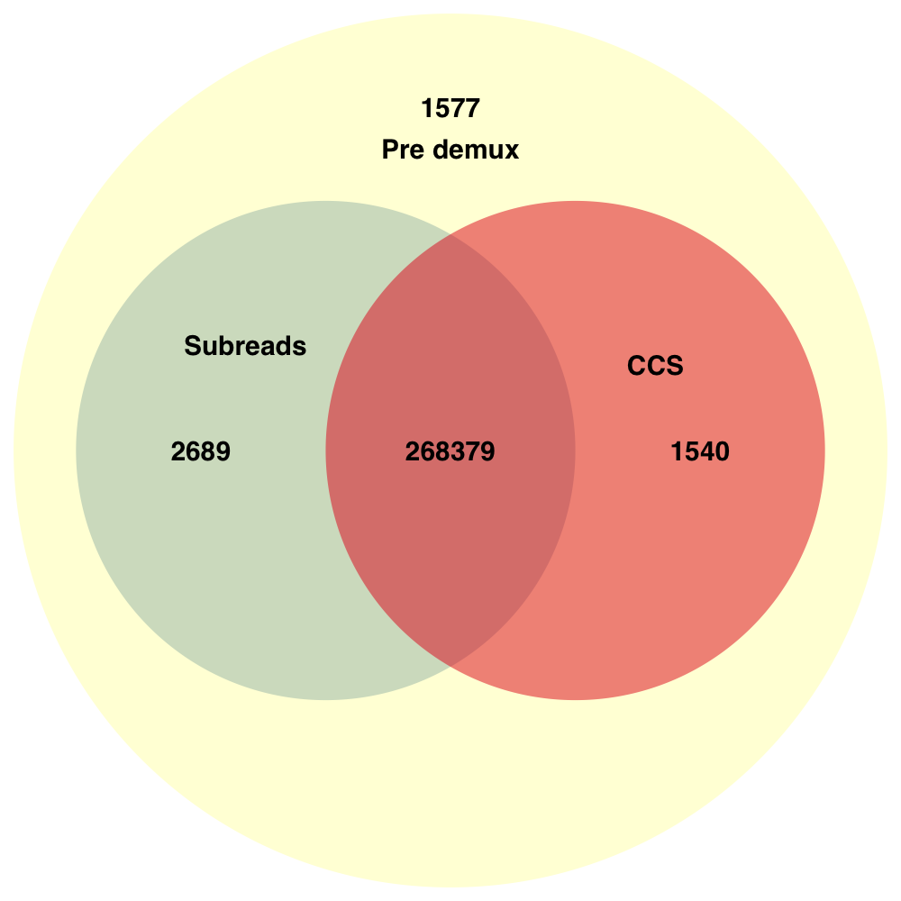

## CCS or demux first?
Many people have been wondering, what is the recommended order for a multiplexed
HiFi pool:
  1) first ccs and then demux
  2) first demux and then ccs

### Experiment
Use 2k ecoli amplicons with barcoded overhang adapters, symmetric. Workflow steps:
  1) Generate CCS
  2) Demux subreads and whitelist on CCS hole numbers
  3) Demux CCS
  4) Compare both sets of hole numbers

### Results
Verbatim results for one chip:

    Generated CCS reads : 274185
    Demuxed CCS reads   : 269919 (98.44%)
    Demuxed subreads    : 271068 (98.86%)

Venn diagrams for two chips:

Just based on those numbers, one would say, pick subread demuxing.
Here comes the but. Demuxing subreads is very IO heavy and takes ~100x longer
than demuxing CCS.
For the sake of time to result and disk space,
**perform CCS first and demux afterwards**.

### Discussion
Q: Is there any systematic reason for reads that get correctly called by subread demux but not ccs or vice versa?

Let's plot subread barcode scores, grouped by if they were only called in subreads (blue) or not (red)

Majority of what is subread output only is on the verge of being called at all.
The problem with the current CCS draft stage is that it sometimes trims a few
bases, which is generally not a big issue for demuxing, but if the barcode is
molecularly damaged, too short or of low quality, a few missing bases lead to
being uncallable.

Vice versa, only called by CCS and not in subreads:

Again something that is on the verge being called. The reason for the ~300 reads
at 100 score, no idea so far. In general, this is 0.1% of the data.
Let's investigate those ~300 calls and plot their subread demux barcode scores.

It's curious why they didn't get called, but for 0.1% not worth changing
any parameters now, but worth future investigation.
