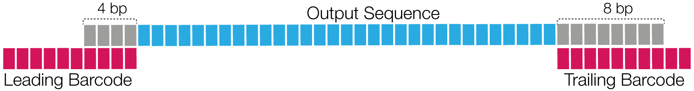

## `--min-end-score`
This threshold is applied to the two individual barcode scores, the leading and
trailing barcode.
ZMWs with at least one individual barcode score below `N` are omitted.
The default is `0`.

Simplified example: A ZMW is tagged with two barcodes `A` and `B`.
All leading barcode regions match to `A` with score `90` and
all trailing barcode regions match `B` with score `30`.
On average, the barcode score is `(90+30)/2=60`. Option `--min-end-score`
filters on an individual barcode level, checking `90` and `30`.
Using `--min-end-score 45`, this ZMW would not pass, because `B` is below the
threshold.

This filter can be used to remove ZMWs that have one good and one bad call,
only useful for asymmetric barcoding schemes with *different* barcodes in a pair.
For libraries with the *same* barcode in pair, this option is identical to
`--min-score`.

## `--min-ref-span` && `--min-scoring-regions`
Those options are used in combination to remove ZMWs that have spurious barcode
hits.
Option `--min-ref-span` defines the minimum reference (read) span relative to
the barcode length to call a barcode region *scoring*.

Option `--min-scoring-regions` defines the minimum number of *scoring* barcode
regions. ZMWs with less than `-min-scoring-regions N` *scoring* regions are
omitted.

The following schematic shows a simplified example, in which the relative
reference spans are `0.4` for leading and `0.8` for trailing barcode regions, as
the barcodes are 10 bp long and span with 4 bp and 8 bp. If we set
 `--min-ref-span 0.5` then only the leading barcode region would be flagged as
*scoring*. Requiring `--min-scoring-regions 2`, this ZMW would fail, as only
one region is above the required reference span.

## Why do most of my ZMWs get filtered by the score lead threshold?
The score lead measures how close the best barcode call is to the second best.
Possible solutions without seeing your data:
 * Is that sample actually barcoded?
 * Are your barcode sequences genetically too close for SMRT sequencing?
   Try CCS calling first and demultiplex with `--ccs`.
 * Are the synthesized products clean and not degenerate?
 * Did the sequencing run perform optimally, is the accuracy in the expected range?
 * Did you run lima twice, first on the original and then on the already
   demultiplexed data? This is not supported, as the barcodes have been clipped
   and removed.

Try to decrease `--score-lead`, with the potential risk of introducing
false positives.

## `--max-scored-barcode-pairs`
Only use up to first `N` barcode pair regions for barcode identification.
The default is `0`, deactivated filter. This is equivalent to the
maximum number of scored adapters in bam2bam.

## `--max-scored-barcodes`
Only use up to first `N` barcode regions for barcode identification.
The default is `0`, deactivated filter. Setting to 1 enables single-pass
and single-barcode calculation.

## `--max-scored-adapters`
Only use the flanking regions of up to first `N` adapters for barcode
identification. Only full adapters, surrounded by subreads, are used. The
default is `0`, deactivated filter. Setting to 1 enables single-pass barcode
calculation using forward and reverse pass.

Caution: If a subread between two full flanking adapters gets removed in PPA,
*lima* will score frankstein flanking barcodes for two consecutive subreads
with what it believes one adapter in the middle.

## `--score-full-pass`
Only use reads flanked by adapters on both sides for barcode identification,
full-pass reads. This is implicit for CCS reads.

## `--per-read`
Score and tag per subread, instead per ZMW. This is implicit for CCS reads.

## `--single-side`
Identify barcodes in molecules that only have barcodes adjacent to one adapter.
This approach makes no assumption about an alternating pattern of barcoded and
barcode-free adapters. In contrast, a 1D k-means similar to the original Lloyd
algorithm is employed to identify two clusters to separate low- and high-scoring
barcode regions. This method does not suffer from irregular adapter calls, but
the additional flexibility might lead to yet-unknown problems.

For this mode, high-scoring barcode regions are whitelisted. Only whitelisted
barcode regions contribute to the final mean barcode score and to the
calculation of `--min-score-lead`.

## `--scored-adapter-ratio`
Minimum ratio of scored vs sequenced adapters. The default is `0.25`.

## `--enforce-first-barcode`
Set the first barcode to be barcode index 0.
