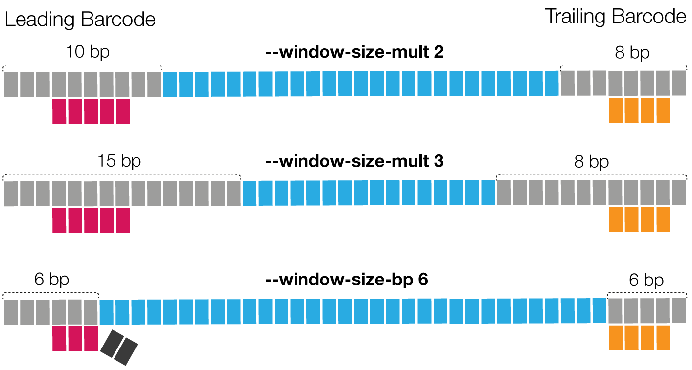

# Filter
*Lima* offers a set of options for processing, including trivial and
 sophisticated filters.

## `--min-length`
Reads with length below `N` bp after demultiplexing are omitted. The default is
`50`. ZMWs with no reads passing are omitted.

## `--max-input-length`
Reads with length above `N` bp are omitted for scoring in the demultiplexing
step. The default is `0`, meaning deactivated.

## `--min-score`
Threshold for the average barcode score of the leading and trailing ends.
ZMWs with barcode score below `N` are omitted. The default is `0`.
It is advised to set it to `26` for CLR and `80` for HiFi.

## `--min-end-score`
This threshold is applied to the two individual barcode scores, the leading and
trailing barcode.
ZMWs with at least one individual barcode score below `N` are omitted.
The default is `0`.

Simplified example: A ZMW is tagged with two barcodes `A` and `B`.
All leading barcode regions match to `A` with score `90` and
all trailing barcode regions match `B` with score `30`.
On average, the barcode score is `(90+30)/2=60`. Option `--min-end-score`
filters on an individual barcode level, checking `90` and `30`.
Using `--min-end-score 45`, this ZMW would not pass, because `B` is below the
threshold.

This filter can be used to remove ZMWs that have one good and one bad call,
only useful for asymmetric barcoding schemes with *different* barcodes in a pair.
For libraries with the *same* barcode in pair, this option is identical to
`--min-score`.

## `--min-ref-span` && `--min-scoring-regions`
Those options are used in combination to remove ZMWs that have spurious barcode
hits.
Option `--min-ref-span` defines the minimum reference (read) span relative to
the barcode length to call a barcode region *scoring*.

Option `--min-scoring-regions` defines the minimum number of *scoring* barcode
regions. ZMWs with less than `-min-scoring-regions N` *scoring* regions are
omitted.

The following schematic shows a simplified example, in which the relative
reference spans are `0.4` for leading and `0.8` for trailing barcode regions, as
the barcodes are 10 bp long and span with 4 bp and 8 bp. If we set
 `--min-ref-span 0.5` then only the leading barcode region would be flagged as
*scoring*. Requiring `--min-scoring-regions 2`, this ZMW would fail, as only
one region is above the required reference span.

## `--min-passes`
ZMWs with less than `N` full passes, a read with a leading and
trailing adapter, are omitted. The default is `0`, no full-pass needed. Example

    0 pass  : insert - adapter - insert
    1 pass  : insert - adapter - INSERT - adapter - insert
    2 passes: insert - adapter - INSERT - adapter - INSERT - adapter - insert

## `--max-scored-barcode-pairs`
Only use up to first `N` barcode pair regions for barcode identification.
The default is `0`, deactivated filter. This is equivalent to the
maximum number of scored adapters in bam2bam.

## `--max-scored-barcodes`
Only use up to first `N` barcode regions for barcode identification.
The default is `0`, deactivated filter. Setting to 1 enables single-pass
and single-barcode calculation.

## `--max-scored-adapters`
Only use the flanking regions of up to first `N` adapters for barcode
identification. Only full adapters, surrounded by subreads, are used. The
default is `0`, deactivated filter. Setting to 1 enables single-pass barcode
calculation using forward and reverse pass.

Caution: If a subread between two full flanking adapters gets removed in PPA,
*lima* will score frankstein flanking barcodes for two consecutive subreads
with what it believes one adapter in the middle.

## `--score-full-pass`
Only use reads flanked by adapters on both sides for barcode identification,
full-pass reads. This is implicit for CCS reads.

## `--keep-idx-order`
Per default, the two identified barcode idx are sorted ascending, as in CLR data,
the correct order cannot be determined. This affects the `bc` tag, `prefix.counts`
file, and `--split-bam` file names; `prefix.report` columns `IdxLowest`,
`IdxHighest`, `IdxLowestNamed`, `IdxHighestNamed` will have the same order as
`IdxFirst` and `IdxCombined`. This option only makes sense for single read data,
such as CCS.

If you are using an asymmetric barcode design with `NxN` pairs
and your input is CCS, you can use `--keep-idx-order` to preserve
the order. If your input is CLR subreads and you use `NxN` asymmetric pairs,
there is no way to distinguish between pairs `bc1001--bc1002` and `bc1002--bc1001`.

## `--per-read`
Score and tag per subread, instead per ZMW. This is implicit for CCS reads.

## `--window-size-mult`
The candidate region size multiplier: `barcode_length * multiplier`, default `3`.
Optionally, you can specify the region size in base pairs with `--window-size-bp`.
Window size has a direct impact on run time.

Following a few examples, pay attention to the last one, where the barcode
can't be fully identified.

## Alignment options

    -A,--match-score        Score for a sequence match.
    -B,--mismatch-penalty   Penalty for a mismatch.
    -D,--deletion-penalty   Deletions penalty.
    -I,--insertion-penalty  Insertion penalty.
    -X,--branch-penalty     Branch penalty.

## `--ccs`
Set defaults to `-A 1 -B 4 -D 3 -I 3 -X 1`

## `--single-side`
Identify barcodes in molecules that only have barcodes adjacent to one adapter.
This approach makes no assumption about an alternating pattern of barcoded and
barcode-free adapters. In contrast, a 1D k-means similar to the original Lloyd
algorithm is employed to identify two clusters to separate low- and high-scoring
barcode regions. This method does not suffer from irregular adapter calls, but
the additional flexibility might lead to yet-unknown problems.

For this mode, high-scoring barcode regions are whitelisted. Only whitelisted
barcode regions contribute to the final mean barcode score and to the
calculation of `--min-score-lead`.

## `--scored-adapter-ratio`
Minimum ratio of scored vs sequenced adapters. The default is `0.25`.

## `--enforce-first-barcode`
Set the first barcode to be barcode index 0.
