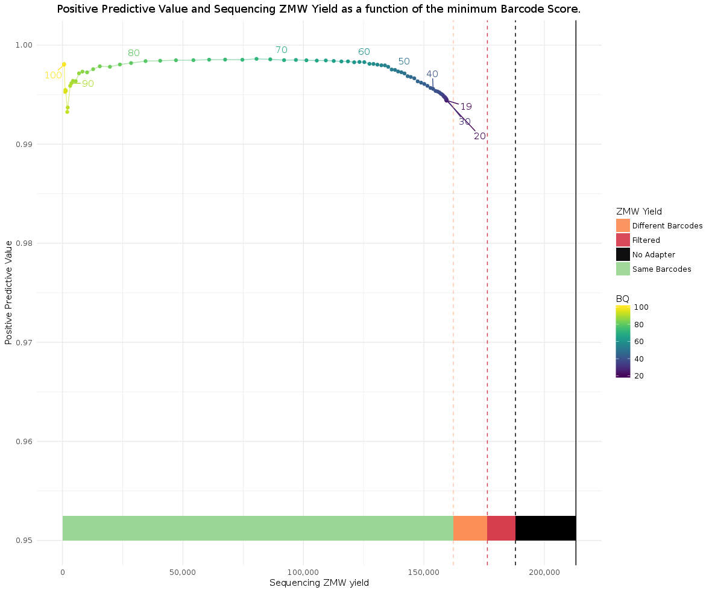
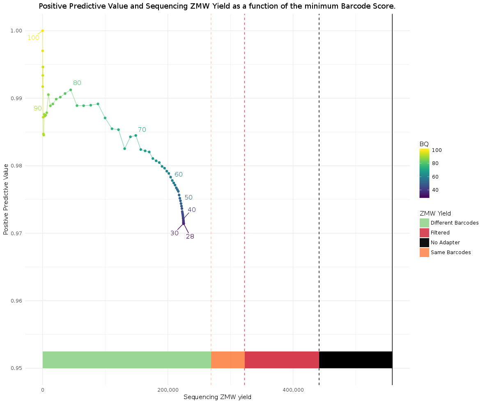
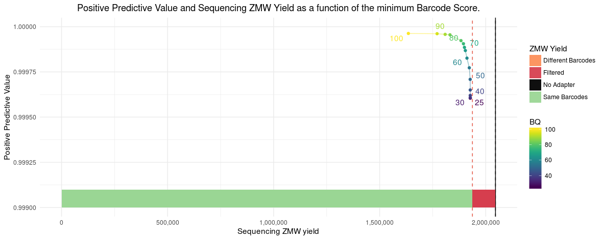

## Positive predictive values / Precision
Performance is measured as positive predictive value (PPV); it measures TP/(TP+FP),
the ratio of true positive calls over all true and false positive calls.
It informs us how much cross-calling has been observed between the desired
barcode pairs. It is also known as precision.
In order to compute a PPV, distinct amplicons of known lengths and origin are barcoded,
sequenced, demultiplexed, and mapped back to the set of known references.
With this approach, true and false positive calls can be counted per barcode pair.
The resulting PPV is due to misidentification by the demultiplexing
algorithm, caused by many different external factors, such as
poorly synthesized barcode molecules, contamination between barcode wells,
and insert contamination during the library preparation.

Depending on the barcoding mode, same or different barcodes on the ends of the
insert, and the number of barcodes used, PPV varies.

Examples for different barcoding schemes, (x) indicating use of a barcode pair:

8-plex same / symmetric

| BCs |  A  |  B  |  C  |  D  |  E  |  F  |  G  |  H  |
| :-: | :-: | :-: | :-: | :-: | :-: | :-: | :-: | :-: |
| A   | x   |     |     |     |     |     |     |     |
| B   |     | x   |     |     |     |     |     |     |
| C   |     |     | x   |     |     |     |     |     |
| D   |     |     |     | x   |     |     |     |     |
| E   |     |     |     |     | x   |     |     |     |
| F   |     |     |     |     |     | x   |     |     |
| G   |     |     |     |     |     |     | x   |     |
| H   |     |     |     |     |     |     |     | x   |

28-plex different / asymmetric

| BCs |  A  |  B  |  C  |  D  |  E  |  F  |  G  |  H  |
| :-: | :-: | :-: | :-: | :-: | :-: | :-: | :-: | :-: |
| A   |     | x   | x   | x   | x   | x   | x   | x   |
| B   |     |     | x   | x   | x   | x   | x   | x   |
| C   |     |     |     | x   | x   | x   | x   | x   |
| D   |     |     |     |     | x   | x   | x   | x   |
| E   |     |     |     |     |     | x   | x   | x   |
| F   |     |     |     |     |     |     | x   | x   |
| G   |     |     |     |     |     |     |     | x   |
| H   |     |     |     |     |     |     |     |     |

36-plex same+different / symmetric+asymmetric

| BCs |  A  |  B  |  C  |  D  |  E  |  F  |  G  |  H  |
| :-: | :-: | :-: | :-: | :-: | :-: | :-: | :-: | :-: |
| A   | x   | x   | x   | x   | x   | x   | x   | x   |
| B   |     | x   | x   | x   | x   | x   | x   | x   |
| C   |     |     | x   | x   | x   | x   | x   | x   |
| D   |     |     |     | x   | x   | x   | x   | x   |
| E   |     |     |     |     | x   | x   | x   | x   |
| F   |     |     |     |     |     | x   | x   | x   |
| G   |     |     |     |     |     |     | x   | x   |
| H   |     |     |     |     |     |     |     | x   |

### CLR
#### PPV
Following libraries contain 2kb amplicons with vector-sequence-specific primers amplified.
Sequencing movies are 6 hours long with additional 2 hours pre-extension.
The instrument version is 5.0.0 and the chemistry is S/P2-C2. For each ZMW,
all sequenced barcode regions were respected.

|   Design   | Plex  | PPV % |
| :--------: | :---: | :---: |
| Symmetric  |   8   | 99.7  |
|            |  16   | 99.7  |
|            |  40   | 99.6  |
|            |  48   | 99.5  |
|            |  96   | 99.4  |
|            |  384  | 99.1  |
| Asymmetric |  28   | 98.8  |
|            |  384  | 97.0  |
|  Sym+Asym  |  36   | 90.6  |

**Results:**
1. With increasing number of barcodes, PPV decreases.
2. Same barcode pair libraries have higher PPV than different barcode pair libraries.
3. Mixing same and different barcode pairs in one library leads to very bad PPV and is *not supported*.

#### Yield

The yield is, after the PPV, the next most important metric. Lima removes unwanted
barcode pairs that are undesired to increase PPV, accepting a decrease in yield.

Example 384-plex symmetric (look at the bars above the x-axis):



Compare it to a 384-plex asymmetric run:



The reason behind the yield decrease for asymmetric is, in order to identify a
ZMW as asymmetric, both flanking barcodes of an insert have to be observed;
ZMWs whose polymerase read does not contain at least two adapters have to be
removed. In contrast, for the symmetric case, it is sufficient to see a single
barcode region.

### HiFi
A 96-plex barcoded adapter library with 2kb insert, 30 hour movie. `ccs` version
5.0.0, `lima` version 2.0.0.

Running `lima` with `--same --ccs`:

```
ZMWs input                (A) : 2045937
ZMWs above all thresholds (B) : 1937358 (94.69%)
ZMWs below any threshold  (C) : 108579 (5.31%)

ZMW marginals for (C):
Below min length              : 0 (0.00%)
Below min score               : 0 (0.00%)
Below min end score           : 0 (0.00%)
Below min passes              : 0 (0.00%)
Below min score lead          : 7651 (7.05%)
Below min ref span            : 292 (0.27%)
Without SMRTbell adapter      : 0 (0.00%)
Undesired diff pairs          : 104029 (95.81%)
```

Following the raw numbers for the PPV/Yield curve below. Yield percentage is
w.r.t. the `1937358` ZMWs from above. The initial 0.44% yield loss is due to
how we process the data for PPV analaysis, requiring at least a 600 bp mapped to
the originating reference.

Without any filtering, PPV is at **99.96%** and with the recommended `--min-score 80`
PPV increases to **99.992%** with an additional **2.2%** yield loss.

| `--min-score` |   PPV    |   Yield   |
| :-----------: | :------: | :-------: |
|      25       | 99.9605% | 99.46948% |
|      30       | 99.9606% | 99.46938% |
|      40       | 99.962%  | 99.46794% |
|      50       | 99.9709% | 99.44724% |
|      60       | 99.9826% | 98.66581% |
|      70       | 99.9886% | 98.05472% |
|      80       | 99.9923% | 97.20697% |
|      85       | 99.9955% | 94.53668% |
|      90       | 99.9958% | 93.35735% |
|      95       | 99.9961% | 91.39106% |
|      100      | 99.9963% | 84.40582% |


