# `report_detail.R`

The first is for the `lima.report` file: `scripts/r/report_detail.R`. Example:

    $ Rscript --vanilla scripts/r/report_detail.R prefix.lima.report

The second, optional argument is the output file type `png` or `pdf`, with
`png` as default:

    $ Rscript --vanilla scripts/r/report_detail.R prefix.lima.report pdf

You can also restrict output to only barcodes of interest, using the barcode
name not the index.
For example, all barcode pairs that contain the barcode "bc1002":

    $ Rscript --vanilla scripts/r/report_detail.R prefix.lima.report png bc1002

A specific barcode pair "bc1020--bc1045"; note that, the script will look for both
combinations "bc1020--bc1045" and "bc1045--bc1020":

    $ Rscript --vanilla scripts/r/report_detail.R prefix.lima.report png bc1020--bc1045

Or any combination of those two:

    $ Rscript --vanilla scripts/r/report_detail.R prefix.lima.report pdf bc1002 bc1020--bc1045 bc1321

## Yield
Per-barcode base yield:

Per-barcode read yield:

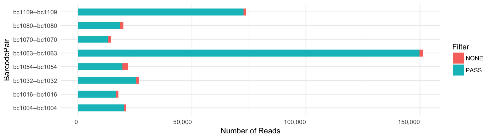

Per-barcode ZMW yield:
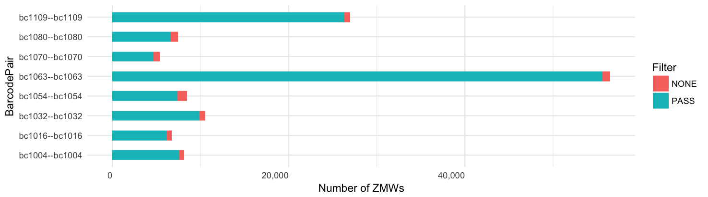

## Scores
Score per number of adapters (lines) and all adapters (histogram).
[What are half adapters?](#what-are-half-adapters)

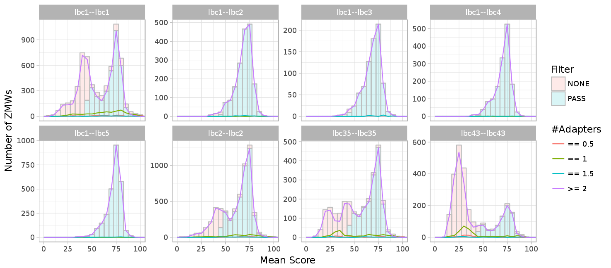

Read length vs. mean score (99.9% percentile)
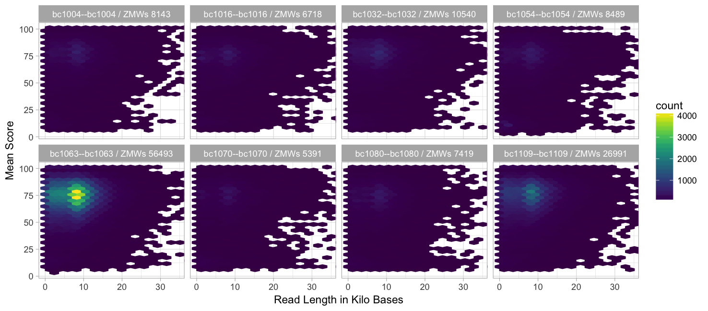

HQ length vs. mean score (99.9% percentile)
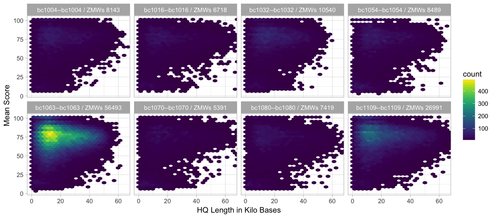

## Read length (99.9% percentile, 1000 binwidth)
Grouped by barcode, same y-axis :

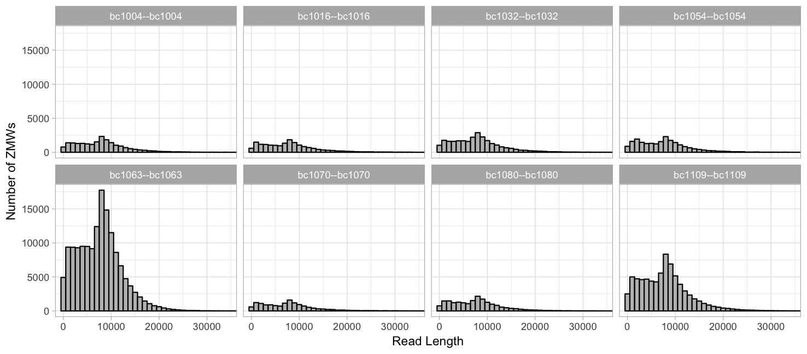

Grouped by barcode, free y-axis:

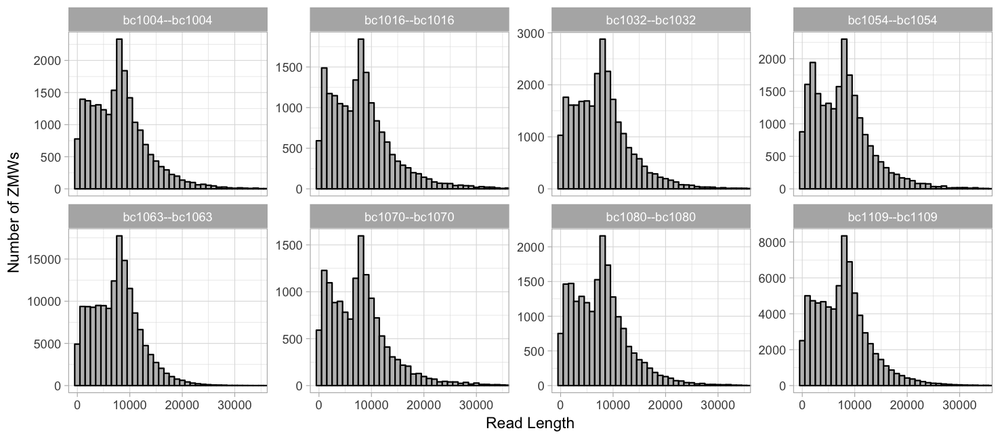

Not grouped into facets, line histogram:

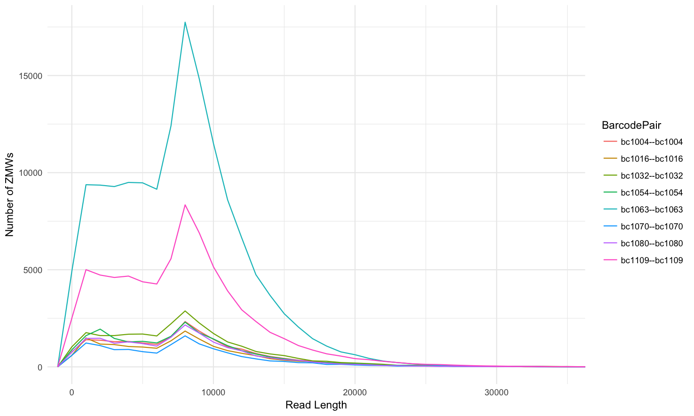

Barcoded vs. non-barcoded:

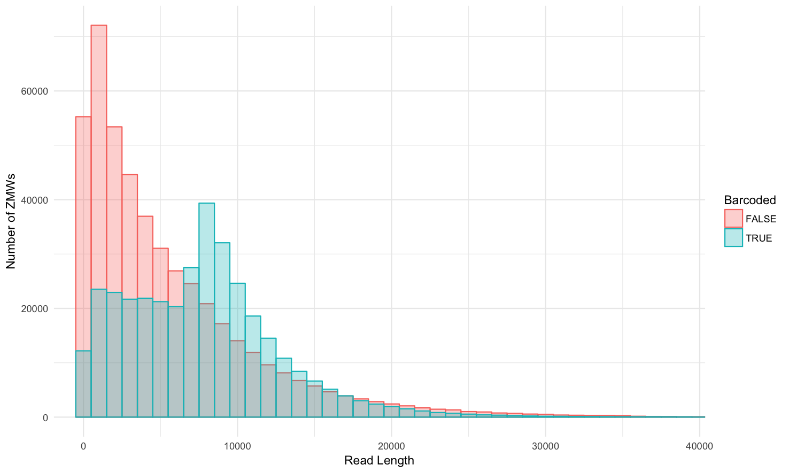

## HQ length (99.9% percentile, 2000 binwidth)
Grouped by barcode, same y-axis:

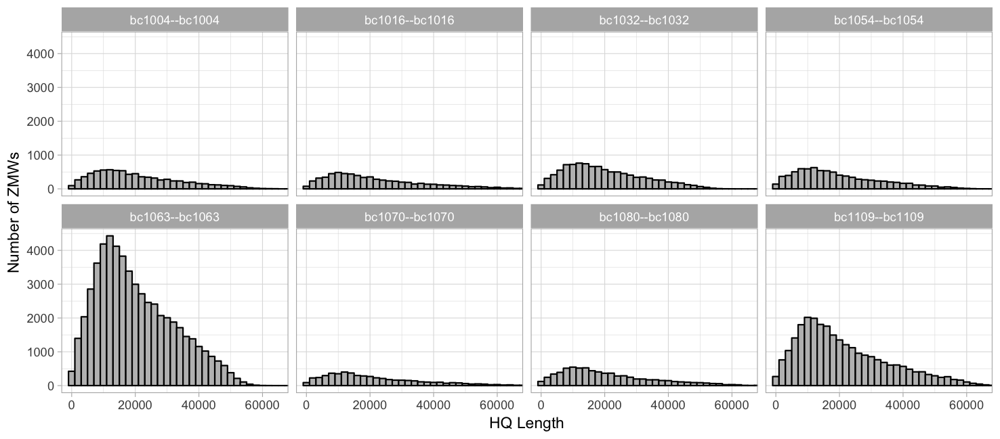

Grouped by barcode, free y-axis:

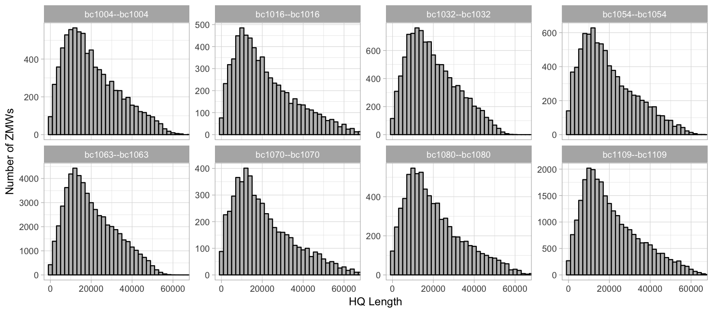

Not grouped into facets, line histogram:

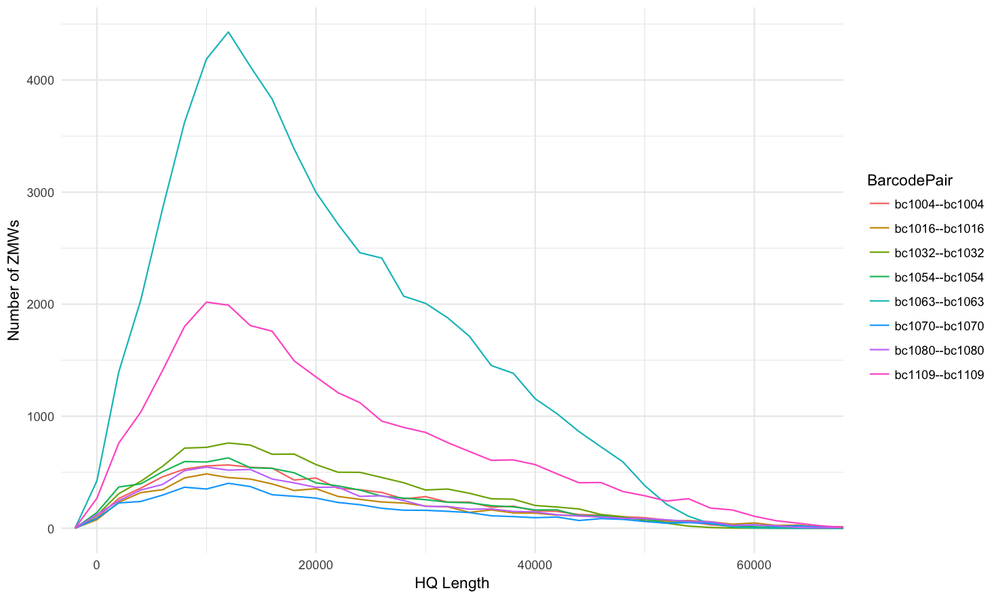

Barcoded vs. non-barcoded:

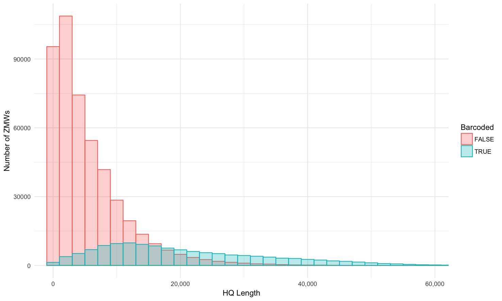

## Adapters  (99.9% percentile, 1 binwidth)
Number of adapters:

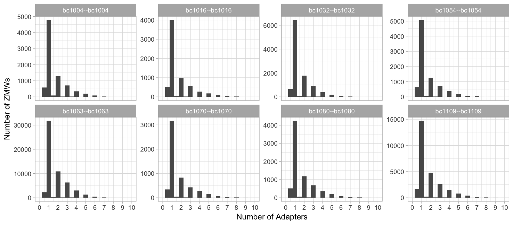

# `report_summary.R`
The second script is for high-plex data in one `lima.report` file:
`scripts/r/report_summary.R`.

Example:

    $ Rscript --vanilla scripts/r/report_summary.R prefix.lima.report

Yield per barcode:

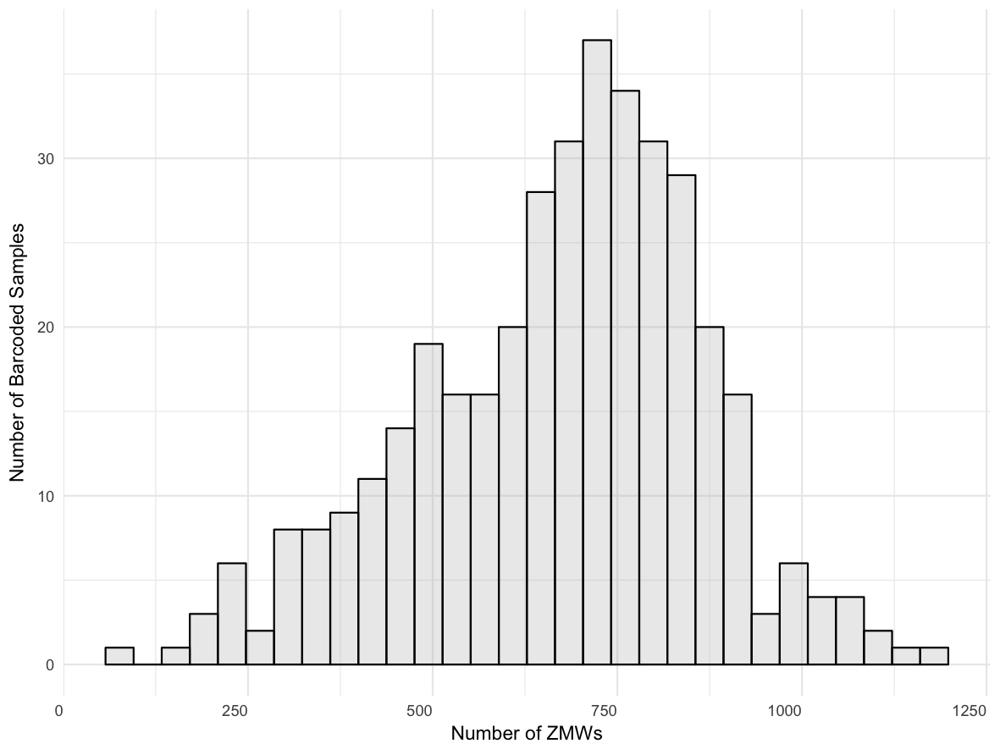

Score distribution across all barcodes:

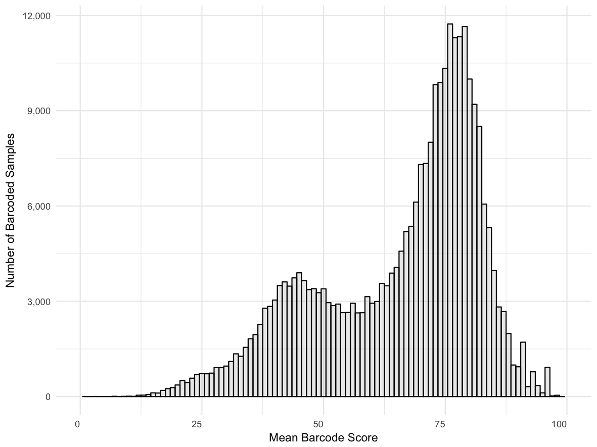

Score distribution per barcode:

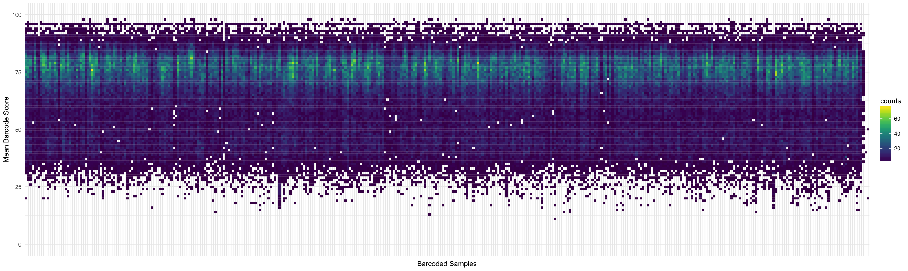

Read length distribution per barcode:

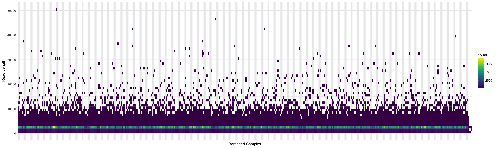

HQ length distribution per barcode:

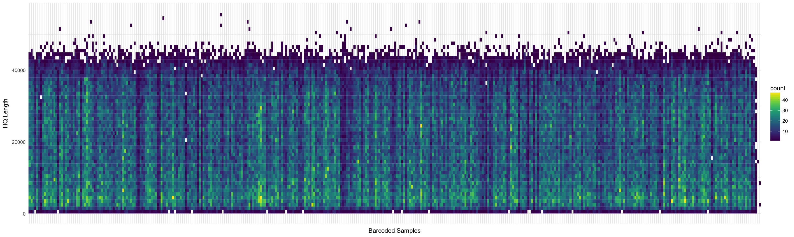

Bad adapter ratio histogram:

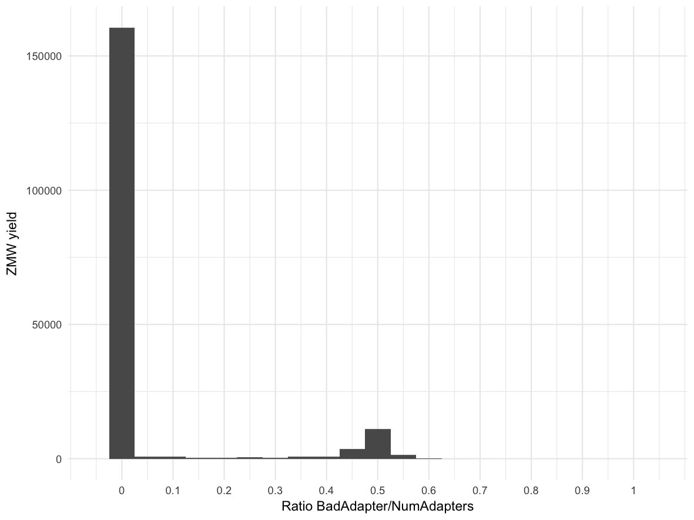
