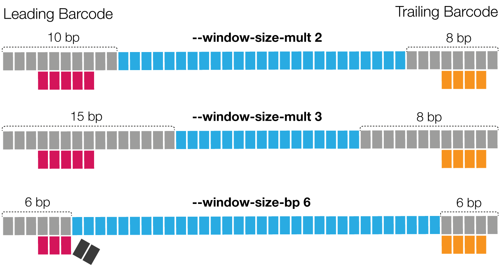

## `--window-size-mult`
The candidate region size multiplier: `barcode_length * multiplier`, default `3`.
Optionally, you can specify the region size in base pairs with `--window-size-bp`.
Window size has a direct impact on run time.

Following a few examples, pay attention to the last one, where the barcode
can't be fully identified.

