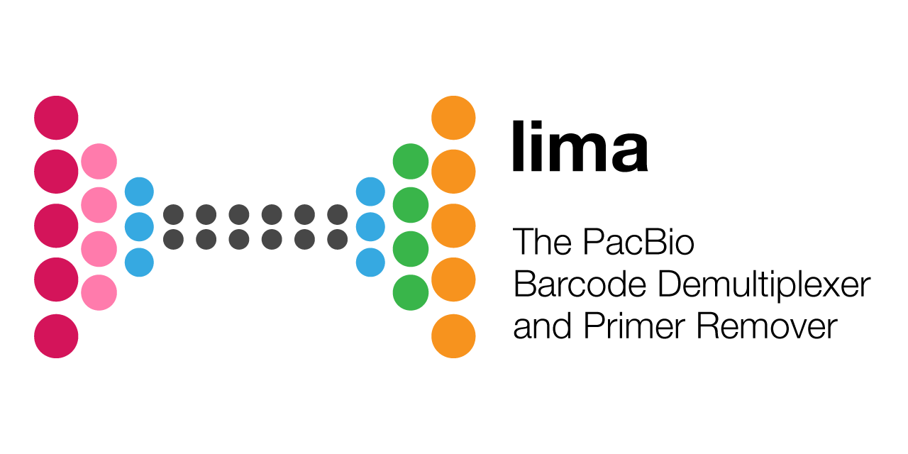

  

***

_lima_ is the standard tool to identify barcode and primer sequences in PacBio
single-molecule sequencing data. It powers the Demultiplex Barcodes, Iso-Seq,
and Mark PCR Duplicates GUI-based analysis applications.

## Availability
Latest version can be installed via bioconda package `lima`.

Please refer to our [official pbbioconda page](https://github.com/PacificBiosciences/pbbioconda)
for information on Installation, Support, License, Copyright, and Disclaimer.

## Latest Version
Version **2.1.0**: [Full changelog here](/changelog)

## What's new!
New documentation is up, a 1:1 port from the original GitHub docs with minor
enhancements. Expect major enhancements in upcoming releases.

## Get started
If you are new to demultiplexing barcoded samples, check out the [Get Started guide](/get-started).
