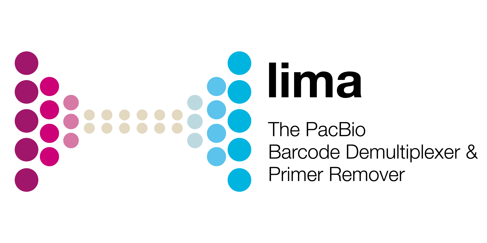

  

***

_lima_ is the standard tool to identify barcode and primer sequences in PacBio
single-molecule sequencing data. It powers the _Demultiplex Barcodes_ GUI-based
analysis applications.

## Availability
Latest version can be installed via bioconda package `lima`.

Please refer to our [official pbbioconda page](https://github.com/PacificBiosciences/pbbioconda)
for information on Installation, Support, License, Copyright, and Disclaimer.

## Latest Version
Version **2.9.0**: [Full changelog here](/changelog)

## What's new
 * Improved precision using [`--hifi-preset SYMMETRIC-ADAPTERS`](/faq/hifi-presets) or `SYMMETRIC`
 * Undo demultiplexing via [`lima-undo`](/faq/undo)

## Get started
If you are new to demultiplexing barcoded samples, check out the [Get Started guide](/get-started).
